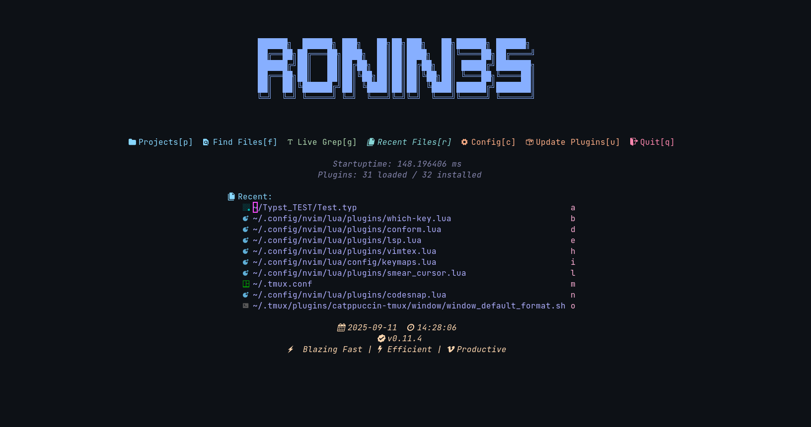

# Ronin3s's Neovim Configuration

This is a personalized Neovim configuration written in Lua. It uses `lazy.nvim` for plugin management and is structured to be modular and easily extensible.



## Features

*   **Plugin Manager**: Uses [lazy.nvim](https://github.com/folke/lazy.nvim) for fast and easy plugin management.
*   **Dashboard**: A welcoming dashboard powered by [alpha.nvim](https://github.com/goolord/alpha-nvim).
*   **Fuzzy Finder**: [Telescope.nvim](https://github.com/nvim-telescope/telescope.nvim) for finding files, buffers, and more.
*   **LSP**: Integrated Language Server Protocol support using [nvim-lspconfig](https://github.com/neovim/nvim-lspconfig).
*   **Syntax Highlighting**: Advanced syntax highlighting with [nvim-treesitter](https://github.com/nvim-treesitter/nvim-treesitter).
*   **File Explorer**: A file explorer tree with [neo-tree.nvim](https://github.com/nvim-neo-tree/neo-tree.nvim).
*   **Statusline**: A feature-rich statusline with [lualine.nvim](https://github.com/nvim-lualine/lualine.nvim).
*   **Tab-like Buffers**: A line with open buffers using [bufferline.nvim](https://github.com/akinsho/bufferline.nvim).
*   **Typst Support**: Comprehensive support for [Typst](https://typst.app/) with LSP, formatting, and compilation.

## Installation

1.  **Clone the repository:**

    ```bash
    git clone <repository-url> ~/.config/nvim
    ```

2.  **Start Neovim:**

    ```bash
    nvim
    ```

On the first run, `lazy.nvim` will bootstrap itself and install all the configured plugins.

## Plugins

This configuration uses a variety of plugins to enhance the Neovim experience. Here are some of the key plugins:

*   [alpha.nvim](https://github.com/goolord/alpha-nvim): A highly configurable dashboard.
*   [telescope.nvim](https://github.com/nvim-telescope/telescope.nvim): A fuzzy finder for files, buffers, and more.
*   [nvim-lspconfig](https://github.com/neovim/nvim-lspconfig): The Language Server Protocol (LSP) client.
*   [nvim-treesitter](https://github.com/nvim-treesitter/nvim-treesitter): For syntax highlighting and code parsing.
*   [neo-tree.nvim](https://github.com/nvim-neo-tree/neo-tree.nvim): A file explorer.
*   [lualine.nvim](https://github.com/nvim-lualine/lualine.nvim): A feature-rich statusline.
*   [bufferline.nvim](https://github.com/akinsho/bufferline.nvim): Provides a line with open buffers.
*   [which-key.nvim](https://github.com/folke/which-key.nvim): Displays a popup with possible keybindings.
*   [Comment.nvim](https://github.com/numToStr/Comment.nvim): Smart commenting.
*   [conform.nvim](https://github.com/stevearc/conform.nvim): A formatting plugin.
*   [vimtex](https://github.com/lervag/vimtex): A comprehensive suite for editing LaTeX files.
*   [catppuccin](https://github.com/catppuccin/nvim): A soothing pastel theme.
*   [nvim-cmp](https://github.com/hrsh7th/nvim-cmp): A completion engine.
*   [codesnap.nvim](https://github.com/mistricky/codesnap.nvim): Create beautiful code screenshots.
*   [indent-blankline.nvim](https://github.com/lukas-reineke/indent-blankline.nvim): Indentation guides.
*   [noice.nvim](https://github.com/folke/noice.nvim): A more modern UI for messages and cmdline.
*   [nvim-notify](https://github.com/rcarriga/nvim-notify): A notification manager.
*   [project.nvim](https://github.com/ahmedkhalf/project.nvim): Project management.
*   [smear-cursor.nvim](https://github.com/sphamba/smear-cursor.nvim): A smooth cursor animation.
*   [toggleterm.nvim](https://github.com/akinsho/toggleterm.nvim): An easy way to manage terminals.

For a full list of plugins, see the `lua/plugins/` directory.

## Keybindings

The leader key is set to `<space>`.

For a detailed list of keybindings, please refer to the documentation in the `DOCS` directory.

## Documentation

This configuration is documented in the `DOCS` directory. Each file in this directory explains the configuration for a specific plugin or feature.
